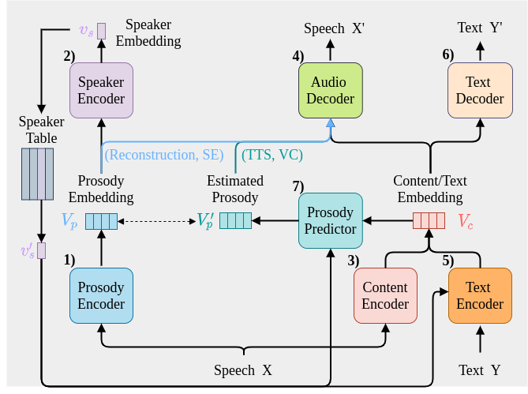

# SpeechNet



## Dependencies:
The required dependencies are in [`requirements.txt`](requirements.txt).
You can install them with `pip install -r requirements.txt`.

Note: If you are using an older torch and encounter an error when running the code like `UnboundLocalError: local variable 'beta1' referenced before assignment`, please update the adamw.py according this [commit](https://github.com/pytorch/pytorch/commit/f8238d7917479b058e750156c362f858f3ec110e#diff-46de6ea1d9fce81c27638ecd7f137c781fd64d02acea698c432a8ddb916ea51fR76).

## How to run

Config file example for training: [`config/libri/conformer_256_AdamW.yaml`](config/libri/conformer_256_AdamW.yaml).
For the dataset paths and hyperparameter setups, please refer to the config file.

### Train:

```shell=zsh
python3 -m torch.distributed.launch --nproc_per_node=<num pf GPUs> main.py --config <path of config file> --name <name of log/ckpt> <--task1 --task2 ...> [--gpus <number of gpus (default is 1)>] [--other options]
eg: python3 -m torch.distributed.launch --nproc_per_node=2 main.py --config config/libri/conformer_256_AdamW.yaml --name five_task_with_per-layer-pcgrad --asr --se --sc --tts --vcb --gpus 2 --no_amp --pcgrad --per_layer
```

### Test:

```shell=zsh
python3 -m torch.distributed.launch --nproc_per_node=<num pf GPUs> main.py --config <path of config file> --name <name of log/ckpt> <--task1 --task2 ...> <--test_task1 --test_task2 ...> [--gpus <number of gpus (default is 1)>] --load <ckpt path> [--other options]
eg: python3 -m torch.distributed.launch --nproc_per_node=2 main.py --config config/libri/conformer_256_AdamW.yaml --name test_five_task_with_per-layer-pcgrad --asr --se --sc --tts --vcb --test_asr --test_se --test_sc --test_tts --test_vcb --gpus 2 --no_amp --load best_five_task.pth 
```

### Options:

Note: Now AMP is not available, so please always use the `--no_amp` option.

* General options:

`--config`: config path  
`--name`: name for logging  
`--load`: trained model path  
`--single_task`: always setting the weights of losses to 1 in multi-task learning  
(default: using [auto-balanced losses](https://arxiv.org/pdf/1705.07115.pdf))  
`--pcgrad`: using [PCGrad](https://arxiv.org/pdf/2001.06782.pdf) for conflicting gradients in multi-task learning  
`--per_layer`: performing the checking of conflicting gradients per layer rather than per module  
`--no_amp`: to disable automatic mixed precision  
`--gpus`: specifying the gpu number  

* Task-specific options:

`--asr`: setups for asr (training/testing)  
`--se`: setups for se (training/testing)  
`--sc`: setups for sc (training/testing)  
`--tts`: setups for tts (training/testing)  
`--vcb`: setups for vcb (training/testing)  

`--test_asr`: testing asr  
`--test_se`: testing se  
`--test_sc`: testing sc  
`--test_tts`: testing tts  
`--test_vcb`: testing vcb  

